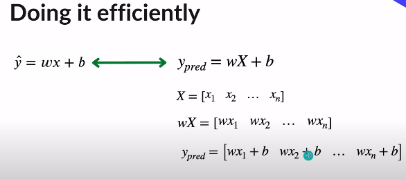
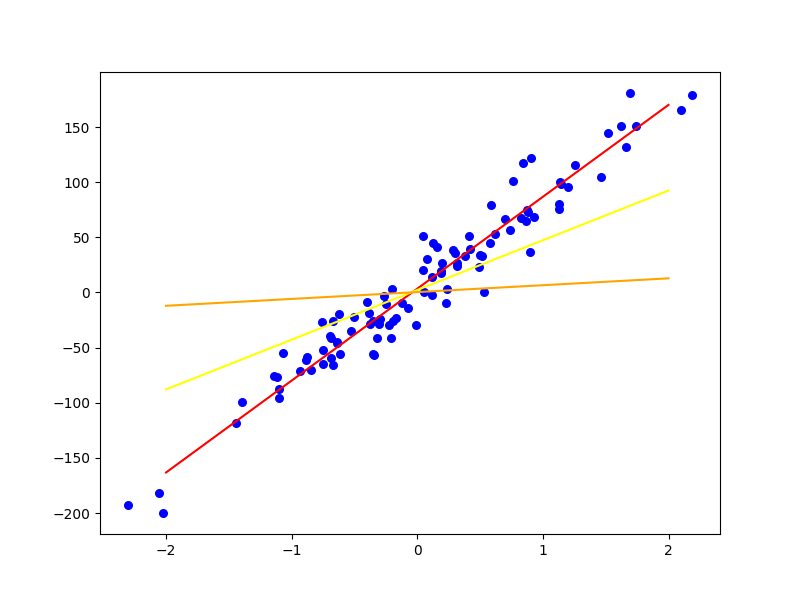

# **Linear Regression**
----
## **Steps**
1. ### Training
- Initialize Weight as Zero
- Initialize Bias as Zero
### Given A Data Point 
#### Predict All points togather using Matrix Methods

#### Calculate Error

#### Use Gradient Descent To Update W and b values

#### Repeat n Times

## Output Results:

