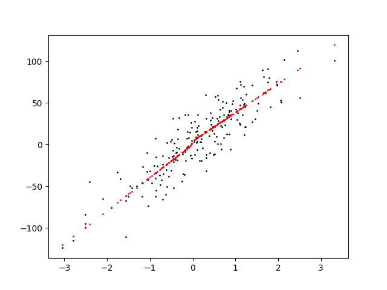
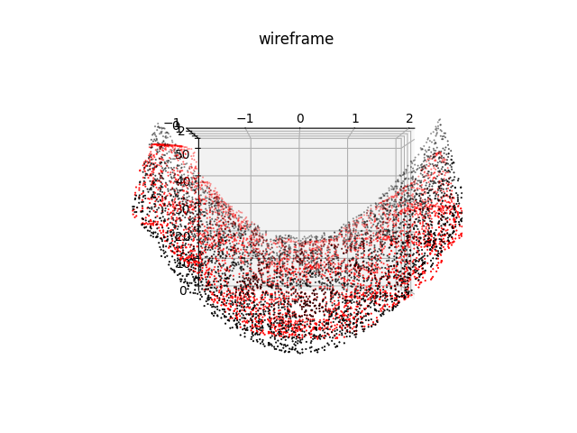

# **Multi Layer Perceptron From Scratch**

---

## **How does Multilayer Perceptron work?**

### **We can summarize the operation of the perceptron as follows it:**

1. Initialize the weights and bias with small-randomized values;
2. Propagate all values in the input layer until output layer(Forward Propagation)
3. Update weight and bias in the inner layers(Backpropagation)
4. Do it until that the stop criterion is satisfied !

---

## **Results**


### 1. Results On data with Single Inputs 



#### Model Details

```js
NN = Network()
NN.add(Dense(1, 8))
NN.add(ReLU())
NN.add(Dense(8, 10))
NN.add(ReLU())
NN.add(Dense(10, 1))
epochs = 1000
```

### 2. Results On data with Two Inputs



#### Model Details

```js
NN = Network()
NN.add(Dense(2, 8))
NN.add(TanH())
NN.add(Dense(8, 8))
NN.add(TanH())
NN.add(Dense(8, 1))
epochs = 1000
```

## **Details**

```js
# Can Add Any number of layers
# Any Input size
# Limitations : Supports Regression
                Supports Only Relu and Tanh Activations for dense
                Supports Only MSE for Output
```