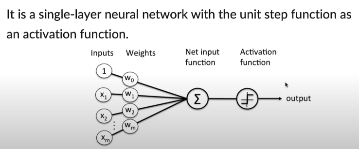
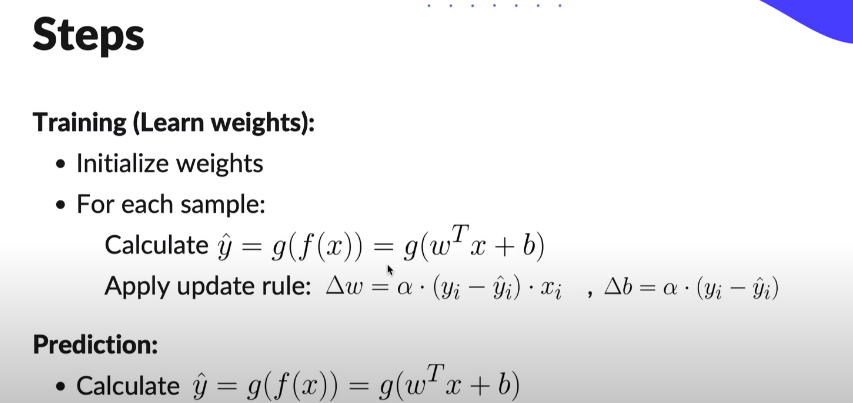
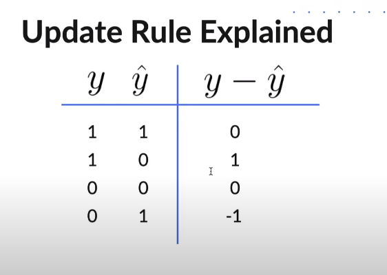
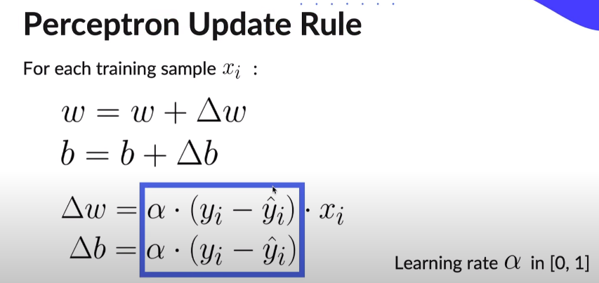
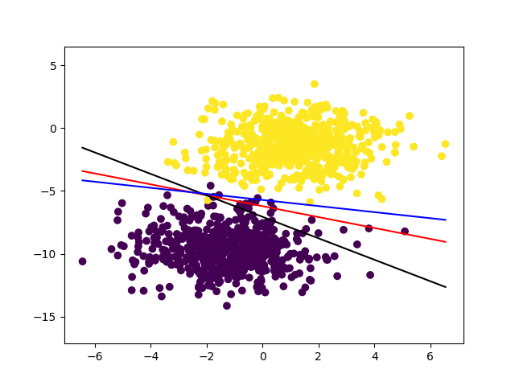

# **Perceptron From Scratch**

---

<details>
<summary style="font-size:20px;">Definition</summary>

```js
The Perceptron is an algorithm for Supervised Learning of Binary Classifiers.
Its can be seen as a single unit of Artificial Neural Network.
Its also known as Prototype of Neural Nets.
```

</details>

## **Types Of Perceptrons**
<details>
<summary>1. Single Layer Perceptron</summary>

```js
Can Learn only Linearly Seperable Patterns
```

</details>
<details>
<summary>2. Multi Layer Perceptron</summary>

```js
Can Learn More Complex Patterns
```

</details>

### Structure


---

## **Steps**




--- 

## Output Results:


